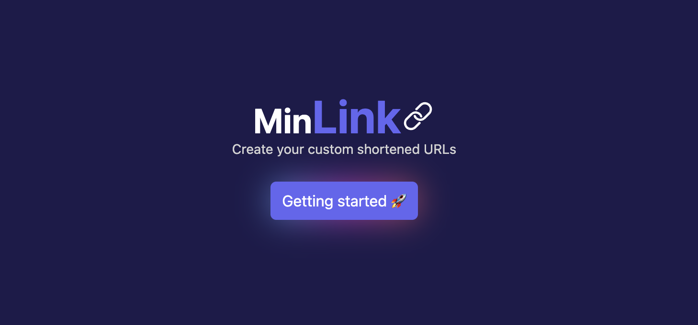

<div align="center">



# Nextjs Url Shortener (minLink)

</div>

<div align="center">
    <a href="https://minlink.vercel.app/" target="_blank">
        Live
    </a>
    <span>&nbsp;✦&nbsp;</span>
    <a href="https://github.com/MenvielleValen/url-shortener">
        Repo
    </a>
    <span>&nbsp;✦&nbsp;</span>
    <a href="https://github.com/MenvielleValen">
        Author
    </a>
</div>

## 🚀 Getting Started

1. [Fork](https://github.com/MenvielleValen/fork) or clone this repository.

```bash
git clone git@github.com:MenvielleValen/url-shortener.git
```

2. Install the dependencies:

- We use Node with LTS 20.11.0 version.

```bash
# Install the version of the .nvmrc file:
nvm use

# Install dependencies:
npm install
```

3. Run the development server:

```bash
# Run with node:
npm run dev
```

4. Open [**http://localhost:3000**](http://localhost:3000/) with your browser to see the result 🚀

## 🔑 Get your environmental variables

Before being able to initialize the application, check the `.env.example` file. Duplicate it and rename the copy to `.env` and apply there the right variables.

```

```
